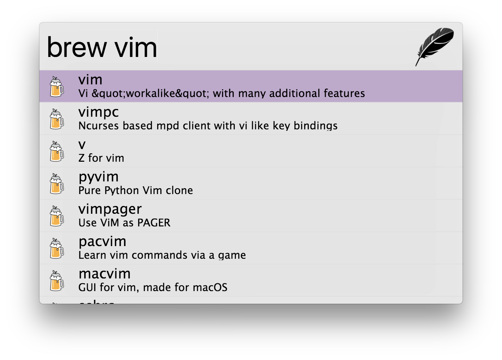

# zazu-homebrew

[](https://greenkeeper.io/)

> [Zazu](https://github.com/tinytacoteam/zazu) plugin to search for [Homebrew](https://brew.sh) formulae with [braumeister.org](http://www.braumeister.org)

[](https://travis-ci.org/danielbayerlein/zazu-homebrew)
[](https://codecov.io/gh/danielbayerlein/zazu-homebrew)
[](https://standardjs.com)
[](https://greenkeeper.io/)

## Usage

To search formulae simply type `brew` then the name of the formula to search for.
For example `brew vim`.



## Install

Add `danielbayerlein/zazu-homebrew` inside of `plugins` block of your `~/.zazurc.json` file.

```json
{
  "plugins": [
    "danielbayerlein/zazu-homebrew"
  ]
}
```

## License

Copyright (c) 2017 Daniel Bayerlein. See [LICENSE](./LICENSE.md) for details.
